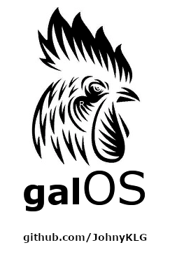

# galOS
<table>
  <tr>
    <td width="190"></td>
    <td>      
Estou iniciando o desenvolvimento de uma interface operacional baseada em hipertexto, com o objetivo de simular de maneira leve e intuitiva um sistema operacional completo, com gerenciador de arquivos, aplicativos de escritório, aplicativos multimidia, etc...

O sistema será executado em duas etapas sendo uma local e outra em nuvem, haverá um gerenciamento de pacotes para sincronizar as duas etapas encriptando as informações se o usuário assim desejar, tornando o sistema portável e ao mesmo tempo seguro.

Uma prévia do sistema pode ser executada em <a href="https://johnyklg.github.io/galOS/ini.html" target="_blank">https://johnyklg.github.io/galOS/ini.html</a>
    </td>
   </tr>
</table>
